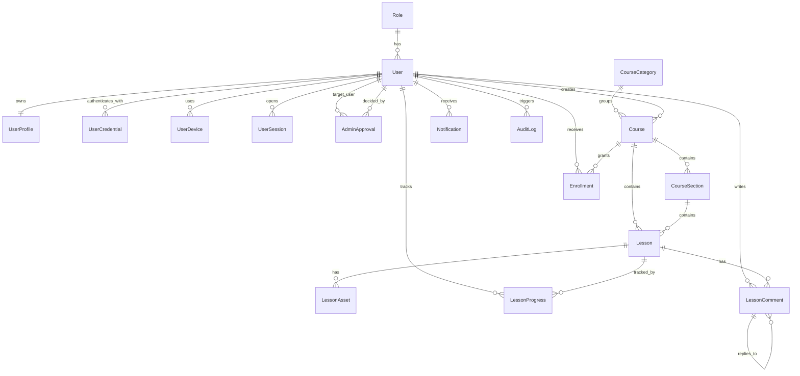

# ERD And Module Breakdown

## ERD



## NestJS module breakdown

### 1. AuthModule
Responsibilities:
- register
- login
- refresh token
- Google OAuth callback
- logout
- password reset later

Contains:
- `auth.controller.ts`
- `auth.service.ts`
- `auth.guard.ts`
- `session.guard.ts`
- JWT strategies

### 2. UsersModule
Responsibilities:
- user profile read/update
- admin user list
- user details for admin

### 3. RolesModule
Responsibilities:
- role constants and role checks
- role decorators/guards

### 4. ApprovalsModule
Responsibilities:
- pending queue
- approve/reject actions
- approval audit creation

### 5. SessionsModule
Responsibilities:
- create session
- revoke previous session on login
- revoke by admin
- session validation

### 6. DevicesModule
Responsibilities:
- fingerprint mapping
- recent device history
- suspicious access support later

### 7. CoursesModule
Responsibilities:
- public course listing
- admin CRUD for courses

### 8. SectionsModule
Responsibilities:
- create/update/reorder course sections

### 9. LessonsModule
Responsibilities:
- lesson CRUD
- student lesson read
- publish/draft checks

### 10. AssetsModule
Responsibilities:
- lesson file metadata
- signed file URLs
- Bunny Stream playback access
- upload session creation

### 11. EnrollmentsModule
Responsibilities:
- grant/revoke course access
- student course visibility checks

### 12. ProgressModule
Responsibilities:
- update lesson progress
- mark complete
- course completion summaries

### 13. CommentsModule
Responsibilities:
- lesson comments list
- create comment/reply
- edit/delete own comment
- admin moderation

### 14. NotificationsModule
Responsibilities:
- approval notifications
- comment reply notifications
- enrollment notifications

### 15. AuditLogsModule
Responsibilities:
- write audit events
- admin view/filter logs later

### 16. SharedModule
Responsibilities:
- common DTOs
- base guards
- utils
- pagination helpers
- error mappers

## Suggested NestJS folder structure

```text
src/
  modules/
    auth/
    users/
    roles/
    approvals/
    sessions/
    devices/
    courses/
    sections/
    lessons/
    assets/
    enrollments/
    progress/
    comments/
    notifications/
    audit-logs/
  common/
    guards/
    decorators/
    interceptors/
    filters/
    dto/
    utils/
  prisma/
  config/
```

## Next.js module breakdown

### Public app
- landing page
- course catalog
- course detail page
- login/register pages

### Student app
- dashboard
- my courses
- course detail
- lesson viewer
- progress summary

### Admin app
- approvals dashboard
- users management
- course CMS
- lesson editor
- enrollments
- moderation

## Suggested Next.js route structure

```text
app/
  (public)/
    page.tsx
    courses/
      page.tsx
      [slug]/page.tsx
    login/page.tsx
    register/page.tsx
  (student)/
    dashboard/page.tsx
    my-courses/page.tsx
    my-courses/[slug]/page.tsx
    lessons/[lessonId]/page.tsx
    pending-approval/page.tsx
  (admin)/
    admin/page.tsx
    admin/users/page.tsx
    admin/courses/page.tsx
    admin/courses/[courseId]/page.tsx
    admin/comments/page.tsx
```

## Suggested Next.js feature folders

```text
src/
  features/
    auth/
    public-courses/
    dashboard/
    learning/
    comments/
    progress/
    admin-users/
    admin-courses/
    admin-enrollments/
    admin-comments/
  components/
    ui/
    layout/
    shared/
  lib/
    api/
    auth/
    constants/
    utils/
```

## Frontend-to-backend boundary

### Frontend handles
- rendering
- local optimistic UI where safe
- routing
- form state
- player UI integration

### Backend handles
- access control
- approval checks
- enrollment checks
- session revocation
- signed asset URLs
- progress persistence
- comment moderation policy

## Integration boundaries

### Bunny Stream integration
- backend stores lesson asset metadata
- backend requests playback access
- frontend receives tokenized playback URL only

### Object storage integration
- backend generates signed download URLs
- frontend never gets permanent private storage paths

## Recommended implementation order

1. Prisma schema + migrations
2. NestJS auth/sessions/approvals/enrollments
3. public Next.js routes
4. admin course CMS
5. student learning pages
6. progress
7. comments
8. signed asset/video access

## Unresolved questions

- choose exact queue provider and redis hosting
- choose exact upload flow for Bunny Stream
- decide whether comments need admin pre-moderation in v1
